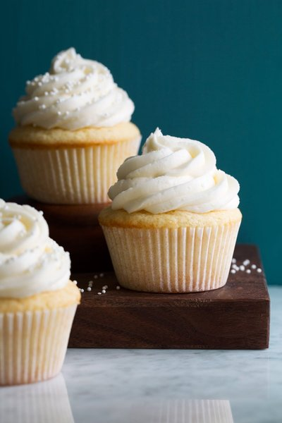

# Sweet Haven Bakery — Website Project

## 1) Project Title
Sweet Haven Bakery  (Part 1 and 2)

## 2) Student Information
- **Name:** [Wamashudu Mathavha]
- **Student Number:** [ST10479223]
- **Module:** [WEDE5020]

## 3) Project Overview (complete)
-**Part 1 focus:** A static, multi-page website for “Sweet Haven Bakery” built in **Part 1** with **HTML only** (no CSS/JS).  
Pages: Home, About, Products (static menu with images & prices), Contact (inquiry form, phone & email).  
Focus: correct HTML structure, content integration, working navigation, and accessibility basics (alt text, headings).
-**Part 2 focus:** mobile-first CSS styling & responsiveness, real social media icons (inline SVG), relative units (rem/em/%), and responsive images (srcset + sizes).
- **Part 3:** Enhancing the website with JavaScript and backend integration.
  - **Contact Form Handling:** Convert the form into a fully working contact form (via JavaScript and backend) to send messages to Sweet Haven Bakery.
  - **Interactive Features:** Add dynamic elements such as form validation, notifications, and additional user interactivity using JavaScript.
  - **Backend Integration:** Implement a backend to handle form submissions (this may require using services like Formspree or building your own server-side functionality).

## 4) Website Goals and Objectives
- Present bakery brand, story, and offerings clearly.
- Provide a static menu with images, descriptions, and pricing.
- Allow customers to make basic inquiries via a contact form (mailto).
- Ensure simple, consistent navigation across pages.
- Lays the foundation for future styling (Part 2) and interactivity (Part 3).
 Present bakery brand, story, and offerings clearly.
- Provide a static menu with images, descriptions, and pricing (static in Part 1, dynamic in Part 3).
- Allow customers to make inquiries and submit messages via an enhanced form (JavaScript + backend handling).
- Ensure smooth navigation and interactivity across all pages.

## 5) Key Features and Functionality

## Part1
- Semantic layout on each page: `header`, `nav`, `main`, `footer`.
- **Home:** welcome text, operating hours, social links.
- **About:** founding story, team, professional footer.
- **Products:** cupcakes, muffins, cakes, pastries, breads, cookies (images + descriptions + prices).
- **Contact:** inquiry form (mailto), clickable landline & cellphone, email & location.
- Basic accessibility: meaningful `alt` text, ordered headings, link titles.

### Part 2
- Mobile-first CSS in `css/style.css`.
- Design tokens (CSS variables) for colors/spacing/typography.
- Typography: Google “Pacifico” for headings; system sans for body.
- Relative units: text & spacing in `rem`/`em`; widths in `%` where appropriate.
- Responsive layout:
  - `.menu-grid` → 1 col (mobile), 2 cols (≥640px), 3 cols (≥1024px).
  - Footer grid → 1 → 2 → 3 columns at the same breakpoints.
- Accessible focus styles with `:focus-visible`.
- Real social icons (Facebook, WhatsApp, TikTok, Instagram) as inline SVG + hover/focus styles.
- Responsive images for all products using:
  `srcset="… 400w, … 800w, … 1200w"` and
  `sizes="(max-width:640px) 100vw, (max-width:1024px) 50vw, 33vw"`.

### Part 3 (JavaScript + Backend)
- **Form Handling**: Using JavaScript to validate form fields, provide feedback to users, and send submissions to the bakery’s email (or via a service like Formspree).
- **Interactive Elements**: Add interactivity such as success/failure notifications after form submission, and dynamically updated content.
- **Backend Integration**: Integrate a backend to handle form submissions securely (Formspree, Firebase, or custom server-side handling).

## 6) Timeline and Milestones
Part 1
| Milestone | Target Date | Status |
|---|---|---|
| Plan content & structure | [2025-08-19] | ✅ |
| Build HTML skeleton (all pages) | [2025-08-21] | ✅ |
| Integrate content & images | [2025-08-23] | ✅ |
| Validate links & basic testing | [2025-08-25] | ✅ |
| Prepare Part 1 submission | [2025-08-26] | ✅ |
Part 2: Add CSS / tokens / layout | [2025-09-22] | ✅
Part 2: Social icons (SVG) across pages | [2025-09-22] | ✅
Part 2: Responsive images (srcset/sizes) | [2025-09-26] | ✅
Part 2: Accessibility pass (focus/contrast/alt) | [2025-09-23] | ✅
Part 3: JavaScript and Backend Integration |[2025-10-15]|

## 7) Part 1 Details
- **What’s included:** HTML pages only; images added; mailto form; no CSS/JS.
- **What’s excluded (for Part 2/3):** layout, colors, responsiveness, JS enhancements, backend form handling.

### Included in part 2
- /index.html, /about.html, /products.html, /contact.html
- /css/style.css (mobile-first responsive styles)
- /images/ product images in three widths (e.g., `cake-chocolate-400.jpg`, `-800.jpg`, `-1200.jpg`)
- Inline SVG social icons

### Included (for Part 3)
Part 3 Details
- **Contact Form Enhancement**: Using JavaScript to validate form fields and provide feedback to users.
- **Form Handling**: Integrated Formspree for backend submission of form data.
  - **JavaScript:** Used to validate user inputs (name, email, message) before submission.
  - **Backend**: Formspree used to capture the email submissions securely.
  - **Interactive Notifications**: Success/failure messages shown to the user after form submission.
- **Backend**: Form submission handled through Formspree (or a similar service), ensuring no server-side code is required for backend handling.

## 8) Sitemap
Home
├─ Welcome
├─ Operating Hours
└─ Connect With Us (social icons)

About
├─ Story & Team
└─ Footer (contact, quick links, legal, social)

Products
├─ Cupcakes
├─ Muffins
├─ Cakes
├─ Pastries
├─ Breads
├─ Cookies
└─ How to Order + Footer (social)

Contact
├─ Contact Details
├─ Inquiry Form (mailto)
└─ Footer (contact, quick links, social)

## 9) Changelog

| Date | Change |
|---|---|
| [2025-08-21] | Created `index.html`, `about.html`, `products.html`, `contact.html`. |
| [2025-08-23] | Added product images, alt text, and prices. |
| [2025-08-24] | Added inquiry form (mailto) and contact numbers. |
| [2025-08-26] | Improved footer on About page (contact, quick links, legal placeholders). |

|**Part 2**|
|[2025-09-22]__: Added `css/style.css` with tokens, grid layout, responsive nav/footer.|
|[2025-09-22]__: Implemented inline-SVG social icons everywhere.|
|[2025-09-26]__: Converted product images to responsive `srcset`/`sizes` (400/800/1200).|
|[2025-09-23]: Added `:focus-visible` outlines and improved interactive states.|
|[2025-09-22]: Marked active nav with `aria-current="page"`.|

**Part 3**
| [2025-10-01] | Integrated backend form handling for the contact form using JavaScript (AJAX). |
| [2025-10-05] | Added interactive animations for buttons (hover/focus). |
| [2025-10-10] | Implemented client-side validation for the contact form (email, phone). |
| [2025-10-12] | Connected the website to a custom domain: www.sweethavenbakery.co.za. |
| [2025-10-15] | Final adjustments to images, added alt text for accessibility. |
| [2025-10-16] | Completed mobile-first JavaScript enhancements for form submissions. |
| [2025-10-17] | Added service worker for offline support. |

## 10) How Responsive Images Work (What I Did & Why)

Each product image has three physical files, e.g.:
images/cupcakes-vanilla-400.jpg
images/cupcakes-vanilla-800.jpg
images/cupcakes-vanilla-1200.jpg

HTML pattern used across the Products page:

- `srcset` lists available widths; `sizes` describes how wide the image appears at breakpoints.
- The browser picks the smallest file that still looks sharp on the user’s screen → faster loads.

## 11) References

Mozilla Developer Network (2024) HTML elements reference. MDN Web Docs. Available at: https://developer.mozilla.org/en-US/docs/Web/HTML/Element (Accessed: 23 August 2025). 

Mozilla Developer Network (2024) Images in HTML. MDN Web Docs. Available at: https://developer.mozilla.org/en-US/docs/Learn/HTML/Multimedia_and_embedding/Images_in_HTML (Accessed: 25 August 2025). 

Mozilla Developer Network (2024) Your first form. MDN Web Docs. Available at: https://developer.mozilla.org/en-US/docs/Learn/Forms/Your_first_form (Accessed: 26 August 2025). 

Web AIM (2024) Alternative Text. Web AIM Articles. Available at: https://webaim.org/techniques/alttext/ (Accessed: 24 August 2025). 

Nielsen Norman Group (2020) Wireframes: A Comprehensive Guide. NN/g Articles. Available at: https://www.nngroup.com/articles/wireframe-definition/ (Accessed: 26 August 2025). 

GitHub Docs (2025) About GitHub Pages. GitHub Documentation. Available at: https://docs.github.com/en/pages/getting-started-with-github-pages/about-github-pages (Accessed: 26 August 2025).

REFERENCES FOR IMAGES
 https://www.google.com/url?sa=i&url=https%3A%2F%2Fwww.cookingclassy.com%2Fvanilla-cupcakes-recipe%2F&psig=AOvVaw3ZGqPSOWBNDuWz8omWxIUT&ust=1756401308183000&source=images&cd=vfe&opi=89978449&ved=0CBIQjRxqFwoTCMjvvPe-q48DFQAAAAAdAAAAABAE

 https://www.google.com/url?sa=i&url=https%3A%2F%2Fwww.lifeloveandsugar.com%2Fhomemade-moist-chocolate-cupcakes%2F&psig=AOvVaw0l3LxmbViBZbRYbJUL2Ev2&ust=1756401669130000&source=images&cd=vfe&opi=89978449&ved=0CBUQjRxqFwoTCIiXiKTAq48DFQAAAAAdAAAAABAE

 https://www.google.com/url?sa=i&url=https%3A%2F%2Fwww.tasteofhome.com%2Frecipes%2Fbasic-banana-muffins%2F&psig=AOvVaw1coUTJTZgsb_kpjDoFtYo2&ust=1756401760827000&source=images&cd=vfe&opi=89978449&ved=0CBUQjRxqFwoTCODStczAq48DFQAAAAAdAAAAABAK
 https://www.google.com/url?sa=i&url=https%3A%2F%2Fbakerbynature.com%2Fblueberry-muffins%2F&psig=AOvVaw2AtLQmu3bQh-_K6hOi4wZF&ust=1756401852190000&source=images&cd=vfe&opi=89978449&ved=0CBUQjRxqFwoTCKD6hvrAq48DFQAAAAAdAAAAABAE

https://www.google.com/url?sa=i&url=https%3A%2F%2Fbakerbynature.com%2Fblueberry-muffins%2F&psig=AOvVaw2AtLQmu3bQh-_K6hOi4wZF&ust=1756401852190000&source=images&cd=vfe&opi=89978449&ved=0CBUQjRxqFwoTCKD6hvrAq48DFQAAAAAdAAAAABAE

https://www.google.com/url?sa=i&url=https%3A%2F%2Fbakerbynature.com%2Fmy-favorite-vanilla-cake-recipe%2F&psig=AOvVaw2LIl9l7jNfD6G01XuXg-Z0&ust=1756402011838000&source=images&cd=vfe&opi=89978449&ved=0CBUQjRxqFwoTCLiHisrBq48DFQAAAAAdAAAAABAE

https://www.google.com/url?sa=i&url=https%3A%2F%2Fchelsweets.com%2Fthe-best-chocolate-cake-recipe%2F&psig=AOvVaw1H8Q5-KrE41WZYMCyS4mbD&ust=1756402079442000&source=images&cd=vfe&opi=89978449&ved=0CBUQjRxqFwoTCND_lPDBq48DFQAAAAAdAAAAABAE

https://www.google.com/url?sa=i&url=https%3A%2F%2Fpreppykitchen.com%2Fbest-red-velvet-cake%2F&psig=AOvVaw0_vU4L-nXIcaBQPbJ_l4zl&ust=1756402172972000&source=images&cd=vfe&opi=89978449&ved=0CBUQjRxqFwoTCIDF0ZjCq48DFQAAAAAdAAAAABAE

https://www.google.com/url?sa=i&url=https%3A%2F%2Fsugargeekshow.com%2Frecipe%2Fcroissants%2F&psig=AOvVaw3kDE4NgdC325z7QUa8gv3I&ust=1756402412267000&source=images&cd=vfe&opi=89978449&ved=0CBUQjRxqFwoTCLD7pY7Dq48DFQAAAAAdAAAAABAE

https://www.google.com/url?sa=i&url=https%3A%2F%2Fcoburnandbaker.co.uk%2Fshop%2Fproduct%2Ffruit-danish%2F&psig=AOvVaw3bvMgIiBXj9-qkYabvCJSr&ust=1756402300254000&source=images&cd=vfe&opi=89978449&ved=0CBUQjRxqFwoTCJDkgNTCq48DFQAAAAAdAAAAABAE

https://www.google.com/url?sa=i&url=https%3A%2F%2Fasimplepalate.com%2Fblog%2Fcountry-sourdough-bread%2F&psig=AOvVaw0bxE5ZZE6hyFINw7YqsxBE&ust=1756402553392000&source=images&cd=vfe&opi=89978449&ved=0CBUQjRxqFwoTCIi0j83Dq48DFQAAAAAdAAAAABAE

https://www.google.com/url?sa=i&url=https%3A%2F%2Fwww.bbcgoodfood.com%2Frecipes%2Fseeded-wholemeal-loaf&psig=AOvVaw0ciFwkDshz3WbPEQzksjGc&ust=1756402653306000&source=images&cd=vfe&opi=89978449&ved=0CBUQjRxqFwoTCLDaxYTEq48DFQAAAAAdAAAAABAE

https://www.google.com/url?sa=i&url=https%3A%2F%2Fbiggandthicc.com.au%2Fcollections%2Fshop-thicc-cookies%3Fsrsltid%3DAfmBOopgIzB41G0Fp71McCKrFWT_cbRfLTRer6cdNoM6D6yVS09AoXmS&psig=AOvVaw2mYQAKc_dkBRqgJZVExsRL&ust=1756407808767000&source=images&cd=vfe&opi=89978449&ved=0CBUQjRxqFwoTCPj5opbXq48DFQAAAAAdAAAAABAE

https://www.google.com/url?sa=i&url=https%3A%2F%2Fhandletheheat.com%2Fbakery-style-chocolate-chip-cookies%2F&psig=AOvVaw02RwJbIq8q0Y1LYMKeWXSi&ust=1756402741244000&source=images&cd=vfe&opi=89978449&ved=0CBUQjRxqFwoTCOj-uqLEq48DFQAAAAAdAAAAABAE

https://www.google.com/url?sa=i&url=https%3A%2F%2Fbutternutbakeryblog.com%2Fmoist-chocolate-cake%2F&psig=AOvVaw02nslOEk5v9FLrUMsOa69z&ust=1756404310562000&source=images&cd=vfe&opi=89978449&ved=0CBUQjRxqFwoTCPDDwIvKq48DFQAAAAAdAAAAABAE

https://www.google.com/url?sa=i&url=https%3A%2F%2Fwww.vecteezy.com%2Fphoto%2F7902518-bakery-startup-small-business-delivery-one-african-american-female-cook-is-packing-handmade-and-fresh-baked-bread-and-pastries-in-boxes-and-sending-for-online-customer-purchases-in-culinary-kitchen&psig=AOvVaw0m-j0K1BIo23EVGvN_r4Zf&ust=1763642001607000&source=images&cd=vfe&opi=89978449&ved=0CBUQjRxqFwoTCMDYm-2c_pADFQAAAAAdAAAAABAE

https://www.google.com/url?sa=i&url=https%3A%2F%2Fwww.westend61.de%2Fen%2Fphoto%2FVABF01235%2Fyoung-man-baking-cup-cakes-at-home-topping-them-with-cream&psig=AOvVaw2fPwIKha6bTpnU-VQqIDPg&ust=1763641798133000&source=images&cd=vfe&opi=89978449&ved=0CBUQjRxqFwoTCPDosfOb_pADFQAAAAAdAAAAABAE

https://www.istockphoto.com/photo/african-american-woman-bakers-looking-at-camera-chef-baker-in-a-chef-dress-and-hat-gm1389857295-447006096